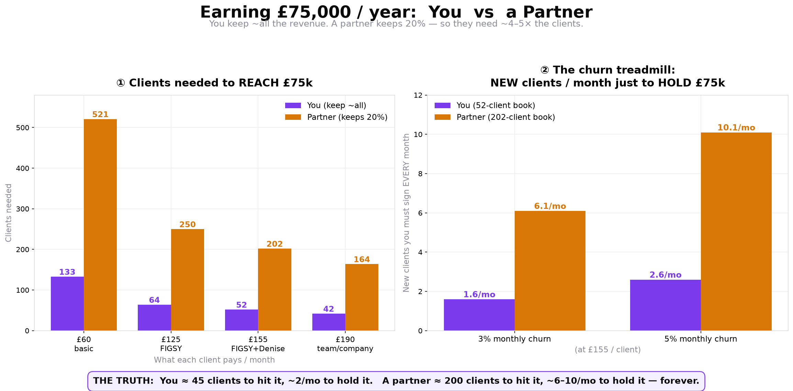

# 💷 Salary & Break-Even Plan — £75,000 / year (You vs a Partner)

> **The hardcore version.** What it takes to pay yourself £75k — and, more importantly, to **HOLD** it. Reaching the number is a climb; holding it is a treadmill that never stops. *Last modelled 16 Jun 2026, off `run-costs-and-cashflow.md` (§5a/5b).*

---

## 🎯 The target
**£75,000/year gross ≈ £4,500/month net ≈ ~£8,000/month in sales.** *(You keep ~93% margin, so revenue ≈ what you need plus a small buffer for costs + FX.)*

## 1️⃣ Reaching it — You vs a Partner
You keep ~all the revenue. **A partner keeps 20% commission** → they need their clients to be paying **~£31,250/month** in total → **~4–5× the clients you do.**

| What each client pays / month | **YOU need** | **A PARTNER needs** |
|---|---|---|
| £60 (basic) | ~133 | ~520 |
| £125 (FIGSY) | ~64 | ~250 |
| **£155 (FIGSY + Denise)** | **~52** | **~202** |
| £190 (team / company) | ~42 | ~165 |

## 2️⃣ 🩸 The churn truth — why retention IS the salary
Reaching the number is a one-time climb. **Holding it means replacing every client who leaves — forever.**

| Book (at £155/client) | **5% monthly churn** | **3% monthly churn** |
|---|---|---|
| **YOU** — 52 clients | bleed ~**3/mo** → must sign ~3/mo to stand still | bleed ~**1.6/mo** |
| **PARTNER** — 202 clients | bleed ~**10/mo** → a full-time sales machine *forever* | bleed ~**6/mo** |

- **Lower churn is the cheat code:** 5% → 3% nearly **halves** the treadmill.
- **The value of retention, concretely:** a 52-client £155 book = ~£8,060/mo. **Every 1% of churn = ~£80/mo of recurring revenue gone (and compounding).** Cutting churn from 5%→3% protects ~£150/mo recurring and saves re-acquiring **~12 clients/year**.
- **Sign 0 new clients and let churn run, and you fall *below* salary every month.** The book is never "done."

## 3️⃣ 🛠️ The plan — concrete
**For YOU (fastest path to £75k):**
1. **Target ~50 clients at ~£155** — push **FIGSY + Denise** on every starter so ARPU stays high (fewer logos to chase).
2. **Sign ~5–6/month** for ~10–12 months → you're at salary.
3. **Then defend it:** keep churn **under 3%**, keep signing **~2–3/month** to stay ahead of the bleed.

**For a PARTNER:**
1. **Not a day-one full income** — it's a *stacking recurring* layer (every 10 clients = +£300/month, forever).
2. **Sell teams, not seats** — company clients (£190+) → **~165, not ~520**.
3. Full-salary partner = **~165–200 clients + signing ~6–10/month forever** = a full-time agency. Realistic play: KIND commission **on top of** their existing business.

## 4️⃣ ⭐ The strategic conclusion — LENA (Customer Success) is a SALARY feature
The entire £75k rests on **holding** clients, not just winning them. So **Customer Success is not a nice-to-have — it is the thing that protects the wage.**

- **LENA (The Caretaker, CS agent — inventory #55/145)** is the churn defense: health scoring, milestone celebration, proactive "here's your next win" nudges, catching at-risk clients *before* they leave.
- **Therefore LENA is a priority build** — its ROI is measured in churn points, and **every churn point is real salary.**
- **The rule: we can't afford to lose a client.** Onboarding (Casey) gets them live; **Lena keeps them winning so they stay.**

## 🎯 The one rule
**ARPU up (sell bigger) + churn down (retain hard) = the salary holds itself.** Everything else is noise.
