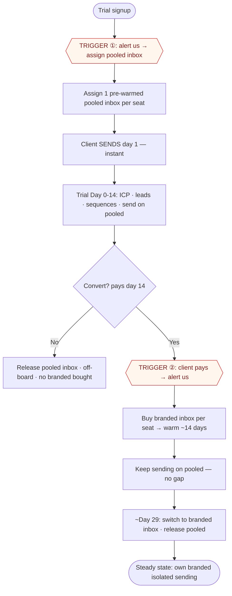

# K.I.N.D — Client Flow SOP
*Last-checked: 1 Jul 2026 — added the locked SENDING & ONBOARDING MODEL (below). The 7 signup/billing paths further down are unchanged (note: Lead-Gen is being retired → single $3 FIGSY, so Paths 5–6 will simplify).*

> **This is the SOP — the standard operating procedures for how the business runs.** It owns the *procedures/flows*; status lives in PRODUCT-INVENTORY, execution in LAUNCH-PAD. Linked from DOC-MAP.

---

## 🔒 SENDING & ONBOARDING MODEL — locked 1 Jul 2026

*How email actually gets sent — for us (M1) and for a client (M2), plus the operations behind it (M3). Cost model locked: pre-warmed pool inbox ~$45 · client branded = $13/yr domain + $4.50/mo per mailbox.*

### A · Our own outreach — Milestone 1 (Instantly)
- **Tool:** Instantly · **one** domain (`gettingkind.com`) · founder-run · **nothing to build.**
- Gated only on the inbox **warmth clock** (~1–2 weeks).
- **Flow:** warmth ≥90% (#198) → upgrade plan → import the 1,461 list → load the 4-step sequence → mail-tester 10/10 (#101) → test-send 10–20 → **fire first outreach** (#127) → replies land in the unibox, monitor reply rate.

### B · New-client sending — Milestone 2 (Smartlead), the pool → branded model
- **Tool:** Smartlead. Each client is **isolated** — their own inbox(es); **count = seats** (SMB = 1 · company = 1 per rep).
- **Instant results via a pre-warmed inbox, then switch to the client's branded domain:**
  1. **Trial signup → TRIGGER ①** (admin alert) → assign a **generic pre-warmed inbox** (Smartlead "Pre-Warmed", instant) → **client sends day 1.**
  2. **Trial (Day 0–14):** client builds ICP / finds leads / drafts sequences and sends on the pooled inbox (theirs alone while active).
  3. **Convert (pays) → TRIGGER ②** (admin alert) → buy the client's **own branded inbox** ($13/yr domain + $4.50/mo) → warms ~14 days (client keeps sending on the pooled inbox — **no gap**).
  4. **~Day 29 → switch** the client to their branded inbox; pooled inbox released back.
  5. **No convert →** release the pooled inbox; off-board; **no branded inbox ever bought** (zero wasted cost).



### C · Operations — Milestone 3 (Admin Centre)
- **Pool management:** pre-warmed inboxes (~$45 each). Two options (decide Thu): **on-demand** (buy one per trial signup — leanest, zero idle spend, if Smartlead has stock instantly) or a **small standing buffer** (2–3) for safety. **Monitor concurrent trials; never run dry.** Released inboxes recycle.
- **The two triggers live in the Admin Centre + email alert** — this is the M3 rebuild: *signup → assign*, *payment → buy + schedule switch*, all visible in admin and wired to the business backend.
- **Financial flow:** Xero · banking · HMRC — the admin cockpit ties billing → accounting.
- **Future:** each AE / staff hire gets **their own** admin access.

---

## Path 1 — Self-service trial (most common)

**Entry point: get-kind.com**

1. Client visits get-kind.com, clicks "Start free trial"
2. Redirected to app.get-kind.com/login → signs up with email + password
3. **No email confirmation required** — lands directly on /onboard
4. Fills in company name, industry, country, phone, website → "Start free trial"

**What happens in the background:**
- Client record created in DB
- 14-day trialing subscription created
- Welcome email sent via Resend

5. Dashboard loads — trial banner visible
6. Client builds ICP → leads appear → explores for 14 days
7. Day 14 — trial expires → full-screen overlay: "Your trial has ended"
8. Client clicks "Choose a Plan" → Billing page → selects plan → Stripe → card entered → paid
9. Webhook fires → subscription flips to active → overlay gone → full access

**If they abandon before paying:** subscription stays `trialing (expired)` — no charge ever.

---

## Path 2 — AE-assisted (your team is involved)

**Entry point: AE sends client to get-kind.com**

1–4. Identical to Path 1 — client self-registers and onboards (no email confirmation needed)

5. AE receives alert (or checks admin portal) — sees new client in Clients list with status "Trial"
6. AE opens client profile in admin portal → reviews subscriptions and details
7. AE calls/emails the client to walk them through signing
8. Client goes to Billing → selects their plan → Stripe → done

---

## Path 3 — Skip trial, pay on day 1

**Entry point: get-kind.com — client already knows they want to proceed**

1–4. Identical — client signs up and onboards
5. Dashboard loads with trial banner
6. Client goes directly to Billing → selects plan → Stripe → card → payment success
7. Subscription flips to active immediately
8. No trial overlay, no gates — full access from day 1

---

## Path 4 — Trial expired, client never paid

1. Trial expires on day 14 → full-screen overlay fires
2. Client clicks "Choose a Plan" → Billing → pays → active

**If client abandons entirely:** subscription stays `trialing (expired)` indefinitely. No charge ever. They appear in admin as trial expired.

---

## Path 5 — Active client upgrades (Lead Gen → Lead Gen + FIGSY bundle)

1. Active client on Lead Gen → Billing → sees FIGSY products
2. Selects FIGSY bundle → Stripe → payment
3. New subscription created with product: `lead_gen_figsy`
4. Dashboard shows FIGSY unlocked
5. **Admin action needed:** cancel the old Lead Gen-only subscription in admin portal

---

## Path 6 — Active client adds FIGSY as an add-on (not full bundle)

1. Active client on Lead Gen → Billing → "Add FIGSY"
2. Currently manual process: AE activates FIGSY in admin portal → grant subscription
3. Client sees FIGSY unlocked on next load

**This is intentionally manual for now** — FIGSY is a higher-touch product.

---

## Path 7 — Sales team demo

1. AE goes to admin.get-kind.com → Demo Environments
2. Fills in: prospect name, company name, industry, country, expiry date, AE name
3. System creates: real Supabase user + client + all 4 products active + runs real Apollo ICP
4. Leads start appearing within minutes
5. AE clicks "Open Demo" → portal opens in new tab, logged in as the demo client
6. AE walks the prospect through the live platform — real leads, real scores
7. After demo: demo expires automatically on set date, or AE can expire immediately

---

## Summary table

| Path | Who | Trial? | AE involved? | Works today? |
|------|-----|--------|-------------|-------------|
| 1 — Self-service trial | Client | Yes | No | ✅ Yes |
| 2 — AE-assisted | Client + AE | Yes | Yes | ✅ Yes |
| 3 — Pay day 1 | Client | Skipped | No | ✅ Yes |
| 4 — Trial expired, no payment | Client | Expired | Optional | ✅ Yes |
| 5 — Upgrade to bundle | Active client | No | Admin action | ✅ Yes (manual cancel old sub) |
| 6 — FIGSY add-on | Active client | No | Yes | ✅ Manual |
| 7 — Sales demo | AE only | Demo | Yes | ✅ Yes |

---

## Flowchart — All 7 Paths

```mermaid
flowchart TD
    %% ── ENTRY POINTS ──
    WEB([get-kind.com\nStart free trial]) --> SIGNUP
    AE_SEND([AE sends client\nto get-kind.com]) --> SIGNUP
    AE_DEMO([AE goes to\nadmin.get-kind.com]) --> DEMO_FORM

    %% ── COMMON SIGNUP FLOW ──
    SIGNUP[app.get-kind.com/login\nSign up with email + password]
    SIGNUP --> ONBOARD[/onboard\nCompany · Industry · Country · Phone · Website]
    ONBOARD --> DB_CREATE[(DB: client row created\n14-day trial subscription\nWelcome email via Resend)]
    DB_CREATE --> DASHBOARD[Dashboard loads\nTrial banner visible]

    %% ── PATH 1: SELF-SERVICE TRIAL ──
    DASHBOARD --> ICP[Build ICP\nApollo search fires automatically]
    ICP --> LEADS[Leads appear\nAI scored 0–100]
    LEADS --> EXPLORE[Explore for 14 days]
    EXPLORE --> TRIAL_END{Day 14\nTrial expires?}
    TRIAL_END -->|Yes| OVERLAY[Full-screen overlay\nYour trial has ended]
    OVERLAY --> BILLING_PAGE[Billing page]
    BILLING_PAGE --> STRIPE_CHECKOUT[Stripe checkout]
    STRIPE_CHECKOUT --> PAID{Payment\nsucceeds?}
    PAID -->|Yes| ACTIVE([Subscription active\nFull access ✅])
    PAID -->|No| ABANDONED([Trial expired\nNo charge\nAdmin shows as expired])
    TRIAL_END -->|No — still in trial| EXPLORE

    %% ── PATH 2: AE-ASSISTED ──
    DB_CREATE --> AE_ALERT[AE sees new client\nin admin portal]
    AE_ALERT --> AE_CALL[AE calls / emails client\nwalks them through platform]
    AE_CALL --> BILLING_PAGE

    %% ── PATH 3: PAY DAY 1 ──
    DASHBOARD --> SKIP_TRIAL[Client goes straight\nto Billing]
    SKIP_TRIAL --> STRIPE_CHECKOUT
    STRIPE_CHECKOUT --> PAID

    %% ── PATH 4: TRIAL EXPIRED, NEVER PAID ──
    OVERLAY -->|Client returns later| BILLING_PAGE

    %% ── PATH 5: UPGRADE TO BUNDLE ──
    ACTIVE --> UPGRADE[Active client\ngoes to Billing]
    UPGRADE --> FIGSY_BUNDLE[Selects FIGSY bundle\nStripe payment]
    FIGSY_BUNDLE --> NEW_SUB[(New subscription:\nlead_gen_figsy)]
    NEW_SUB --> FIGSY_UNLOCKED[FIGSY unlocked\non dashboard]
    FIGSY_UNLOCKED --> ADMIN_CANCEL[Admin cancels\nold Lead Gen sub]

    %% ── PATH 6: FIGSY ADD-ON (MANUAL) ──
    ACTIVE --> ADDON[Client requests\nFIGSY add-on]
    ADDON --> AE_MANUAL[AE grants FIGSY\nsubscription in admin portal]
    AE_MANUAL --> FIGSY_UNLOCKED

    %% ── PATH 7: SALES DEMO ──
    DEMO_FORM[Fill in: prospect name · company\nindustry · country · expiry · AE]
    DEMO_FORM --> DEMO_CREATE[(System creates:\nReal Supabase user + client\nAll 4 products active\nApollo ICP runs automatically)]
    DEMO_CREATE --> DEMO_LEADS[Real leads appear\nwith AI scores]
    DEMO_LEADS --> OPEN_DEMO[AE clicks Open Demo\nPortal opens as demo client]
    OPEN_DEMO --> DEMO_WALKTHROUGH[AE walks prospect through\nlive platform]
    DEMO_WALKTHROUGH --> DEMO_END{Demo outcome}
    DEMO_END -->|Prospect converts| SIGNUP
    DEMO_END -->|Expires / AE closes| DEMO_EXPIRED([Demo expired\nAuto or manual])

    %% ── STYLING ──
    classDef entry fill:#0066FF,color:#fff,stroke:none,rx:8
    classDef action fill:#f5f5f7,stroke:#d1d5db,color:#0a0a0a
    classDef db fill:#7c3aed,color:#fff,stroke:none
    classDef success fill:#059669,color:#fff,stroke:none
    classDef dead fill:#6b7280,color:#fff,stroke:none
    classDef decision fill:#d97706,color:#fff,stroke:none

    class WEB,AE_SEND,AE_DEMO entry
    class SIGNUP,ONBOARD,DASHBOARD,ICP,LEADS,EXPLORE,OVERLAY,BILLING_PAGE,STRIPE_CHECKOUT,AE_ALERT,AE_CALL,SKIP_TRIAL,UPGRADE,FIGSY_BUNDLE,FIGSY_UNLOCKED,ADMIN_CANCEL,ADDON,AE_MANUAL,DEMO_FORM,DEMO_LEADS,OPEN_DEMO,DEMO_WALKTHROUGH action
    class DB_CREATE,NEW_SUB,DEMO_CREATE db
    class ACTIVE,DEMO_EXPIRED success
    class ABANDONED dead
    class TRIAL_END,PAID,DEMO_END decision
```

---

*Update this document whenever a new client path is added or an existing path changes.*
