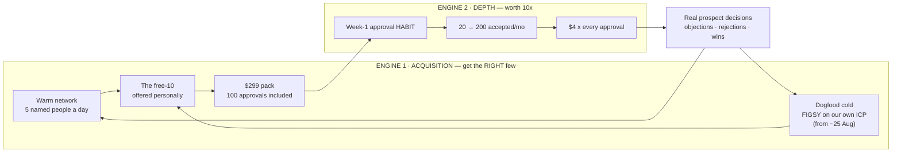

# 🎯 GO-TO-MARKET — the strategy

> **Built with the founder 12 Aug.** Three decisions set the shape: **(1)** warm network now, dogfood cold from ~25 Aug · **(2)** aim at the *systems buyer* — the agency that wants predictability, not the one in a panic · **(3)** the wedge is **control**: you approve every prospect before anyone is contacted.
>
> **This doc owns the STRATEGY — why we do it this way.** The actions live in [`MARKETING-PLAN.md`](./MARKETING-PLAN.md) §3, the words in [`voice.md`](./voice.md), the messages in [`warm-outreach-kit.md`](./warm-outreach-kit.md). Nothing here holds status; that is PRODUCT-INVENTORY's job.

---

## 1 · The number that decides everything

Every figure below is derived from code constants — `LEAD_PRICE_USD`, `PER_CLIENT_MONTHLY_USD`, `cost-floor.ts` — never typed from memory. Contribution per accepted lead is **$3.17** ($4 − $0.56 PDL − $0.06 work − $0.01 reveal − $0.20 Stripe).

### 💰 The money model — the founder's frame, which is the correct one *(re-written 12 Aug after "$468" confused him twice — the word "floor" was wrong both times)*

**There is ONE floor: what the company burns with zero clients — $352/mo today, ~$340 once the failover dies (A12).** Everything else is client-funded:

| | They pay | It costs us | We keep |
|---|---:|---:|---:|
| Setup pack | **$299** | ~$134 (their inbox + domain, 200 names sourced, working, Stripe) | **~$165** |
| Each extra approved lead | **$4** | $0.83 | **$3.17** |
| Their inbox, ongoing | — | $8/mo | out of their lead flow |

Two vendor bills switch on at client #1 and are **paid by client money, never by the founder**: Smartlead ~$94/mo (one account serving ALL clients — one pack's $165 margin covers its first six weeks alone) and Hunter ~$34 in sourcing months. The tables below charge those bills against client revenue — which is why their "net" column is real take-home, not gross.

| Shape | Gross/mo | **Net/mo** | Net per client |
|---|---:|---:|---:|
| 10 clients × 20 accepted | $800 | **+$86** | $9 |
| 1 client × 200 accepted | $800 | **+$158** | $158 |
| 4 clients × 200 | $3,200 | **+$2,036** | $509 |
| 10 clients × 200 | $8,000 | **+$5,792** | $579 |

Same gross in the first two rows. **Nearly double the net, on one tenth the work.** Per-client cost scales with *logos*; contribution scales with *leads*.

Now the line this whole strategy hangs on:

> **Taking ONE existing client from 20 accepted to 200 adds $571/mo.**
> **Winning a NEW client who accepts 20 adds $55/mo.**
> **Deepening is worth 10× acquiring.**

**So this is not a normal GTM.** Most plans are 90% acquisition. Ours is two engines, and the second is where the money is.

---

## 2 · The two engines

**Engine 1 is capped and that is fine.** Ten right clients is the target, not a hundred.
**Engine 2 has no ceiling** and is almost entirely customer success — which is why CS is not a support function here, it is the revenue function.

---

## 3 · The wedge — and why it can't be copied

**"You approve every prospect before anyone is contacted."**

Every AI-outreach competitor sells **volume**: more sends, more sequences, faster. Their entire value proposition is that you *don't* look at the list. **They cannot add approval without destroying what they sell.** We can offer it because the product was built that way — the client's 👍 is the only thing that spends money.

It also answers the actual fear that stops an agency founder buying outbound: **not "will it work?" but "will something go out under my name that embarrasses me?"** The systems buyer has usually watched an SDR or a tool do exactly that.

### ⚠️ The tension this creates — and the most important sentence in this document

Control means approving. Depth means approving **200 times a month**. So:

> **Approval is not a gate. It is the engagement metric — and the revenue.**
> The thing that differentiates us and the thing that pays us are the *same action*.

That is a rare and strong position, but it inverts badly: **any friction in approving kills the promise and the revenue at once.** If a client finds approving tedious, they drift to the 20-lead minimum, sit near break-even (17.3 at ten clients), hit the 30-day cold check, and suspend.

**Therefore the single most important job after a client pays is building an approval habit in week one.** Not onboarding. Not training. Habit.

---

## 4 · The stages — triggered by evidence, never by date

### Stage 0 · NOW → ~25 Aug — warm only

Cold sending cannot happen: the mailboxes are warming. **This is a feature of the timing, not a delay** — it forces the highest-converting channel first.

| Do | Target |
|---|---|
| Warm-100 list, **5 personally-written messages a day** | 100 sent by day 30 |
| The free-10 offered **by you, to named people** (R21) | 5 runs |
| Log every reply **reason**; bank every objection | every one |
| beehiiv + LinkedIn company page live | week 1 |
| **Watch each free-10 recipient use Milla, in person** | every one |

⭐ **Exit condition: 1 paying client, hand-held.** Not five. One, watched closely, with the product's rough edges found by you rather than by them.

### Stage 1 · ~25 Aug → client 4 — dogfood the cold engine

The mailboxes warm, and **FIGSY starts prospecting agency founders for M&V.** This is the strongest proof available: *we found you with the thing we're selling you.*

| Do | Why |
|---|---|
| Point FIGSY at our own ICP | The product proves itself before the call |
| Every real prospect decision → the content bank | Nobody else can post our system's actual reasoning |
| **Depth motion on client 1** — get them from 20 → 200 | Worth 10× a second client |
| Weekly newsletter + Thursday DROP Show | Compounding |

⭐ **Exit: 4 clients and 400 accepted leads/mo** — R15's VA trigger, and deliberately a *concentration* test: lose any one client and the VA is still covered.

### Stage 2 · client 4 → client 10 — hire the depth

First hire is **customer success** (R16), because CS *is* Engine 2. At four clients you are at **+$2,036/mo** if they're deep — that funds help.

### Stage 3 · 10 deep clients — $8,000/mo, +$5,792 net

The decision point in the hiring plan. **Not 100 clients. Ten, deep.**

---

## 5 · What we deliberately do NOT do

| Not doing | Why |
|---|---|
| Chase logo count | 10 × 20 nets $86. The number of clients is not the goal |
| Paid ads before revenue | **R24/R7.** Ads buy more of a working message; we don't have one yet |
| A public free-10 offer | **R21** — it is the founder's personal lure, not a landing-page giveaway |
| Personal founder brand | **R2** — brand-voiced, always |
| Compete on volume or price | The wedge is control. Price-leading invites price-shopping |
| Onboard a client we can't watch | 280 items are unwalked. Every early client is hand-held |

---

## 6 · The scoreboard

Two numbers matter more than the rest, and they map to the two engines.

| Metric | Engine | Why it beats the alternatives |
|---|---|---|
| **Conversations with named ICP humans** | 1 | Predicts revenue. Followers and impressions do not |
| ⭐ **Accepted leads per client per month** | **2** | **The whole business.** 20 is break-even-ish; 200 is the model working |
| Clients | 1 | Useful only alongside the metric above |
| Reply **reasons** logged | both | The content bank and the product roadmap in one |
| Free-10 runs offered | 1 | The only acquisition action fully in your control |

⚠️ **If we ever report client count without accepted-leads-per-client beside it, the report is lying** — ten shallow clients and one deep one are the same revenue and a tenth of the profit.

---

## 7 · The honest risks

1. **Depth is unproven.** No client has ever gone from 20 to 200. The entire model rests on it and it is an assumption, not evidence. **First thing to test on client 1.**
2. **280 items are unwalked.** Warm-first is partly a fragility strategy: a hand-held client tells you what broke; a stranger churns silently.
3. **Approval friction is the kill-switch.** See §3. If approving is tedious, both the wedge and the revenue die.
4. **Your network is finite.** Stage 0 has a hard ceiling — which is exactly why Stage 1 exists.
5. **Cold outreach is unproven at our end.** Nothing has ever been sent. Send-day (~25 Aug) is a real risk event, not a formality.
