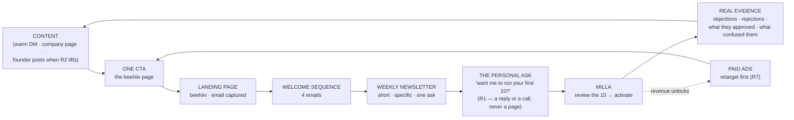

# 📣 MARKETING PLAN — how K.I.N.D gets known

> **This is the doc you open for marketing.** It holds the **plan and the recurring actions** — daily, weekly, monthly. It holds **no product status** (that is PRODUCT-INVENTORY) and **no launch execution** (that is LAUNCH-PAD). It is an *operational* doc like `SEND-DAY-RUNBOOK.md`, **not a fifth core doc** — the four-doc contract in `CLAUDE.md` is untouched.
>
> **Inventory id: #632** (reserved by R6, 6 Aug, for exactly this). Detail files live in this folder — see [`README-marketing.md`](./README-marketing.md).

---

## 🛑 READ THIS FIRST — two founder locks gate this plan

Written down, cited by date, because a plan that quietly walks through a lock is how the lock dies.

### LOCK 1 · R2 — stealth is narrowed, not lifted *(6 Aug)*

> *"Stealth is NARROWED, not lifted. A LinkedIn **company page** is allowed. **No personal announcement.** Outreach goes to friends personally — visible inside a trust circle, not to the market."*
> Founder's words: *"dont worry about me stealth. i wont publicy announce on linkdein. i will create a linkdein company page. and also reach out personally to friends. this way i am stealth within a trust circle"*

**What this blocks:** founder-led public posting 3–5×/week — the centre of the plan as briefed.

**What it does NOT block, and this is the point:** the warm list, the 100 names, the beehiiv build, the welcome sequence, the whole content *bank*, every script, and the first paying clients. **Warm outreach is the highest-yield channel at your stage anyway** and it is fully inside the trust circle.

| | Needs R2 lifted? |
|---|---|
| Build the warm-100 list · send the first 20 · ask for introductions | ❌ no |
| Stand up beehiiv · landing page · welcome sequence · weekly issue | ❌ no |
| LinkedIn **company** page + posting from it | ❌ no — R2 explicitly allows it |
| Bank content: every objection, rejection reason, real prospect decision | ❌ no |
| **Founder posting publicly under your own name** | ✅ **YES — your call** |
| **Paid ads** (they are public by definition) | ✅ **YES** — and R7 too |

**→ DECISION OWED (§9).** Until you rule, everything above the line runs and the public step waits. Nothing else is blocked.

### LOCK 2 · R1 — the free-10 is a sales tool, not a public offer *(6 Aug)*

> *"...offered on the fly in a call or demo and built only when a real client needs it — **never pre-built, never in code, never on the site.**"*

⚠️ **Your own M&V playbook contradicts this and it predates the ruling.** Section 06 calls the free-10 *"Locked: one free allocation of 10 researched prospects inside Milla"* and Section 03 says *"run all channels into the same entry offer."* **R1 (6 Aug) narrows that.** The playbook is not wrong — it was written first. R1 wins.

**How this plan honours both:** the **public** magnet is the newsletter. The **free-10 stays the sales tool** — offered by you, in a reply or a call, to a named person. That is R1 read exactly as written, and it costs nothing: a stranger who signs up to a newsletter is not a client, and the free-10 was never meant to convert strangers.

### Two more, smaller

| Lock | Effect here |
|---|---|
| **R9** *(6 Aug)* — the M&V brand hierarchy is **killed** | The playbook's Section 02 (*"M&V is the brand"*) is **superseded**. Public copy says **K.I.N.D**. Do not rebuild the hierarchy. |
| **P12** — the website is founder-locked | The playbook's *"update all public copy"* actions **cannot be done** without your command. beehiiv is outside the freeze; `get-kind.com` is not. |
| **R7** *(6 Aug)* — real money waits | Paid ads are **gated on revenue**, not on a date. See [`paid-ads-phase-plan.md`](./paid-ads-phase-plan.md). |

---

## 1 · The strategy in one paragraph

You are pre-revenue with almost no traffic, and the thing you sell — a pipeline you did not have to build yourself — is **easiest to prove by doing it, not describing it.** So the system is: **be useful in public (or in private, per R2), collect emails into one place you own, and make the ask personally.** The newsletter is the asset that compounds; the warm list is what pays this month. Paid ads buy more of a message that is already working — never before.

**One audience. One painful problem. One entry offer. One conversion path.** *(Your playbook's own opening line, and it is right.)*

| Decision | The answer, until data changes it |
|---|---|
| **Market** | **GLOBAL — US/UK primary** (R23, 12 Aug: *"Global"*; supersedes the UK-only row that stood here) · agencies and consultancies, 5–30 staff, referral-dependent |
| **Problem** | Senior people are split between billable delivery and business development |
| **Outcome** | More qualified conversations, a more predictable pipeline |
| **Public magnet** | The **newsletter** — a weekly, short, specific email |
| **Sales offer** | *"Want me to run your first 10?"* — **by you, to a named person** (R1) |
| **Conversion** | Review the 10 in Milla → activate → $299 pack, then $4 per approved lead |
| **Improve** | More → Better → New, in that order |
| **Public brand** | **M&V (Milla & Vida) — the trading brand, as the live site masthead has it.** K.I.N.D Technologies is the registered company. (R22 corrected 12 Aug: *"registered as KIND Technologies but trade as Milla and Vida"* — my first write-up had this upside down) |
| **Voice** | ONE voice for everything public — [`voice.md`](./voice.md) (absorbed 12 Aug from the Cowork bundle, its best asset) |

---

## 2 · The growth loop

**The loop's engine is H, not A.** Every rejected prospect, every objection, every "why did you approve that one" is the raw material for next week's content. That is why you never run out of things to say and why generic AI-sales posts lose to yours: **you have the machine's actual decisions and nobody else does.**

---

## 3 · THE RECURRING ACTIONS — daily · weekly · monthly

This is the part that makes the plan a system instead of a document. **These slot into the operating rhythm you already have** (`SALES` 9am–12pm, `CS + VIDA` early + 1–3pm).

### 🔁 DAILY — 30 minutes, inside the 9am–12pm sales block

| # | Action | Why | Owner | When |
|---|---|---|---|---|
| D1 | **5 warm reach-outs**, personally written, to named people | The only channel that can pay this month | 🧍 | daily, Mon–Fri |
| D2 | **Log every reply reason** — not reply/no-reply, the *reason* | *"Record reply reason, not just reply/no reply"* — your playbook. This is the content bank | 🧍 | daily |
| D3 | **Bank one piece of evidence** — an objection, a rejected prospect, a question | Content comes from the bank, never from a blank page | 🧍 | daily |
| D4 | **Answer every inbound within the day** | Speed-to-lead is the whole product thesis; live it | 🧍 | daily |
| D5 | *(when R2 lifts)* **One post** on the chosen channel | Compounding | 🧍 | daily, Mon–Fri |

### 📅 WEEKLY

| # | Action | Why | Owner | When |
|---|---|---|---|---|
| W1 | **Send the newsletter + the DROP Show post** (Problem → Impact → Solution → ROI — the week's anchor, absorbed 12 Aug) | Consistency beats brilliance. Missing a week costs more than a weak issue | 🧍 | Thu (pick one, never move it) |
| W2 | **Write next week's issue from the bank** | 45 min if the bank is fed; 3 hours if it isn't | 🧍 | Sat block |
| W3 | **Top up the warm list to 100 live names** | The list is consumed by D1 — it must be refilled | 🧍 | Sat block |
| W4 | **The weekly review** — [`marketing-metrics-and-iteration.md`](./marketing-metrics-and-iteration.md) | Decide what changes. Nothing changes mid-week | 🧍 | Mon, 20 min |
| W5 | **Ask two people for one introduction each** | Referrals are the cheapest lead getter and they compound | 🧍 | weekly |
| W6 | *(when ads run)* **Review spend against qualified signups, not clicks** | Cheap clicks are how budgets die | 🧍 | Mon, with W4 |

### 🗓️ MONTHLY

| # | Action | Why | Owner | When |
|---|---|---|---|---|
| M1 | **One deeper piece** — a teardown, a benchmark, a real case study | The asset that outlives the week and earns links | 🧍 | last Sat |
| M2 | **Re-read the one-page plan (§1 table). Change it only here** | Prevents channel drift — *"change the one-page plan only in the weekly review, not ad hoc"* | 🧍 | monthly |
| M3 | **Prune the list** — remove hard bounces and 90-day non-openers | A list you don't clean is a deliverability problem waiting | 🧍 | monthly |
| M4 | **Check marketing spend against the cost floor** | The floor is **$352/mo today, $468 once live**. beehiiv's entry tier is $0 — keep it that way until revenue | 🧍 | monthly, with CFO hat |
| M5 | **One conversation with a non-buyer** — why not? | The most valuable 20 minutes in the month | 🧍 | monthly |

---

## 4 · THE NEXT 30 DAYS

**Everything in Weeks 1–3 runs regardless of R2.** Only Week 4's public step is gated.

### Week 1 — build the machine (nobody sees anything)

| ☐ | Action | Owner | When |
|---|---|---|---|
| ☐ | Create the beehiiv publication — [`beehiiv-setup-checklist.md`](./beehiiv-setup-checklist.md) | 🧍 | Day 1 |
| ☐ | ⚠️ **Sending domain: use `news.get-kind.com` or beehiiv's own.** NEVER authenticate `kindoutreach.com` or `trykind.org` — those are the warming ladder and a newsletter blast through them destroys three weeks of work | 🧍 | Day 1 |
| ☐ | ⚠️ **Never touch `gettingkind.com` MX** — that is Resend inbound reply-capture (A18) | 🧍 | standing |
| ☐ | Landing page live with ONE ask: subscribe | 🧍 | Day 2 |
| ☐ | Write the 4-email welcome sequence | 🧍 | Day 3 |
| ☐ | Build the warm-100 list | 🧍 | Day 4–5 |
| ☐ | LinkedIn **company** page (R2 allows this) | 🧍 | Day 5 |

### Week 2 — warm outreach, the only channel that pays this month

| ☐ | Action | Owner | When |
|---|---|---|---|
| ☐ | Send the first 20 warm messages, personally written | 🧍 | Day 8–9 |
| ☐ | Log every reply **reason** | 🧍 | daily |
| ☐ | **Send newsletter issue #1** to whoever is on the list, even if it is 11 people | 🧍 | Day 11 |
| ☐ | Ask 5 non-buyers for one introduction each | 🧍 | Day 12 |
| ☐ | Bank every objection you hear | 🧍 | daily |

### Week 3 — first evidence, first fixes

| ☐ | Action | Owner | When |
|---|---|---|---|
| ☐ | Next 30 warm messages, using what week 2 taught | 🧍 | Day 15–17 |
| ☐ | **Watch one person's onboarding live.** Write down every friction point | 🧍 | Day 16 |
| ☐ | Issue #2 — built from a real objection | 🧍 | Day 18 |
| ☐ | Turn the most repeated objection into a copy or product change | 🧍 | Day 19 |
| ☐ | First weekly review with real numbers | 🧍 | Day 15 |

### Week 4 — decide about going public, then amplify

| ☐ | Action | Owner | When |
|---|---|---|---|
| ☐ | **🚦 RULE ON R2** — public founder posting, yes or no. Everything below waits on this | 🧍 | Day 22 |
| ☐ | *(if yes)* Pick ONE channel. Post 3×. Same CTA every time | 🧍 | Day 23–26 |
| ☐ | *(if no)* Double the warm list instead. It is not a worse plan — it is a slower-compounding one | 🧍 | Day 23–26 |
| ☐ | Issue #3 · #4 | 🧍 | Day 25, 32 |
| ☐ | Review the 30 days honestly: what actually produced a conversation? | 🧍 | Day 30 |

---

## 5 · What we are NOT doing, and why

Written down so it does not get re-proposed every month.

| Not doing | Why |
|---|---|
| **Paid ads before revenue** | R7 — real money must move and there is none. Ads buy more of a working message; you don't have one yet |
| **A public Free10 landing offer** | R1 — never on the site. It stays your sales tool |
| **Rebuilding the M&V brand hierarchy** | R9 — killed 6 Aug, *"kill it"* |
| **Touching the website** | P12 — founder-locked. Flag, never edit |
| **Multiple channels at once** | *"The channel changes. The entry offer does not."* One channel, learned properly |
| **A big content calendar up front** | *"Building a huge content calendar before you know which ideas earn attention"* is on your own avoid-list |
| **Newsletter sends from the warming domains** | Three weeks of warm-up destroyed for one blast. Non-negotiable |

---

## 6 · What this costs

| Item | Cost | Note |
|---|---|---|
| beehiiv entry tier | **$0** | Free to a few thousand subscribers. Stays $0 until revenue |
| LinkedIn company page | **$0** | |
| Your time | **~30 min/day + one Saturday block** | Already in the operating rhythm |
| **Total added to the cost floor** | **$0** | Deliberate. The floor stays $352/mo today, $468 once live |
| Paid ads | **£0 until gated open** | R7 |

---

## 7 · How this connects to the product

The marketing system and the product are the **same loop**, which is the unfair advantage and should be said out loud:

- **You use your own product for your own outreach.** Instantly is ours, Smartlead is the clients'. Both run inside the product — no CSV hand-off.
- **Cold outreach becomes self-serving once the mailboxes warm (~25 Aug).** That is the third Core Four engine switching on for free.
- **Every client interaction feeds content.** Rejections, approvals, objections — the bank fills itself as a by-product of delivery.
- ⚠️ **But nothing sends before the ladder.** Warm-up ends ~25 Aug. The newsletter is a *different* system on a *different* domain and is not gated by it.

---

## 8 · The scoreboard

Full detail in [`marketing-metrics-and-iteration.md`](./marketing-metrics-and-iteration.md). The short version:

| Metric | Week 4 target | Why this one |
|---|---|---|
| Warm messages sent | 100 | The only input fully in your control |
| Reply **reasons** logged | every reply | The content bank |
| Newsletter subscribers | 50 | Small is fine. Real is not optional |
| Open rate | >40% | Below 30% means the list or the subject line is wrong |
| **Conversations had** | **10** | ⭐ The only metric that predicts revenue |
| Free-10 runs offered | 5 | Personally, per R1 |
| **Clients** | **1** | Everything else is a leading indicator of this |

⚠️ **Followers, impressions and clicks are not on this list on purpose.** They are the metrics that feel like progress while nothing happens.

---

## 9 · DECISIONS OWED — founder

| # | Decision | Why it matters | Owner | When |
|---|---|---|---|---|
| **1** | **R2 — do you go public under your own name?** | Gates founder posting and all paid ads. Everything else runs either way | 🧍 | **by Day 22** |
| **2** | If yes — **which channel**: LinkedIn, X, or Instagram? | LinkedIn is the obvious one for UK agency founders. Pick one, not three | 🧍 | with #1 |
| **3** | **Newsletter name and sending domain** | `news.get-kind.com` recommended. Not the warming domains | 🧍 | Day 1 |
| **4** | **Publish day** — Thursday recommended | Never moves once chosen | 🧍 | Day 1 |
| **5** | Does the M&V playbook stay the strategic source, given R1/R9 supersede two of its sections? | Recommendation: **yes, keep it** — mark the two superseded sections rather than rewriting a document you paid attention to | 🧍 | any time |

---

*Sources: the founder's own **M&V Lead Generation Master Playbook** (36pp, an M&V adaptation of publicly described Alex Hormozi / Acquisition.com lead-generation concepts — not affiliated with or a reproduction of $100M Leads), the founder's beehiiv/Big-Desk-Energy brief of 11 Aug, and the register locks R1, R2, R7, R9 and P12 cited above.*
