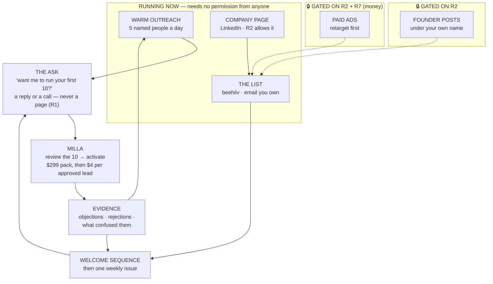

# Founder-Led Marketing System

> **What this is:** the strategy, in plain language, for a technical founder who does not do marketing.
> **Status of the public half: GATED.** R2 (6 Aug) holds — **re-affirmed by the founder on 11 Aug.** No personal public posting yet. Everything in this document that needs R2 lifted is marked **🔒 GATED** and is built ready to switch on.

---

## 1 · The problem, stated honestly

You have a product that works and **nobody knows it exists.** That is not a marketing problem yet — it is an *audience* problem, and they need different solutions.

- A **marketing problem** is "people see my message and don't buy." You fix that with better copy.
- An **audience problem** is "nobody sees anything." You fix that by talking to people you already know, one at a time, until you have proof — and only then buy attention.

You have the second one. **Everything below is ordered accordingly.**

---

## 2 · The system in one picture

**Read the loop backwards and it makes more sense:** you cannot write anything worth reading until you have talked to people. So the warm conversations are not a *channel* — they are the **raw material supply** for everything else.

---

## 3 · The three parts, and what each is actually for

### Part A — Warm outreach *(running now)*

**Job: get client #1 and produce evidence.**

Five named people a day, written by you, no template sent twice. The ask is small: *"want me to run your first 10?"* — not a demo, not a pitch, not a link to a pricing page.

**Why it beats everything else right now:**

| | Warm | Public content | Paid ads |
|---|---|---|---|
| Cost | $0 | $0 | real money you don't have (R7) |
| Time to first conversation | **same day** | weeks | days, but only with budget |
| Needs a lock lifted | **no** | yes (R2) | yes (R2 + R7) |
| Client arrives... | **with you watching** | alone | alone |

That last row is the one nobody thinks about. **281 features are live and unwalked.** A warm contact who hits a broken button tells you. A stranger closes the tab and never comes back.

### Part B — beehiiv: the list you own *(running now)*

**Job: stop renting your audience.**

Followers belong to a platform that can change its algorithm on a Tuesday. **Email addresses belong to you.** beehiiv is where the list lives, and it does three jobs:

1. **A landing page** — one page, one ask: subscribe.
2. **A welcome sequence** — 4 emails that run automatically after signup.
3. **A weekly issue** — short, specific, from real evidence.

**The newsletter is the public magnet, NOT the free-10.** That is R1 read exactly as written. A stranger subscribing to a newsletter costs you nothing; a stranger claiming ten researched prospects costs you sourcing money and gets you a tyre-kicker.

⚠️ **Two hard technical rules — see the checklist for why:**
- **Never authenticate `kindoutreach.com` or `trykind.org` in beehiiv.** Those are the warming ladder.
- **Never touch `gettingkind.com` MX.** That is Resend inbound reply-capture.

### Part C — 🔒 Founder content *(gated on R2)*

**Job: compound. Later.**

Built and ready, switched off. When R2 lifts, the plan is in [`founder-content-playbook.md`](./founder-content-playbook.md): one channel, 3–5 posts a week, four pillars, one CTA.

**What you do instead, right now:** *bank* the content. Every objection, every rejected prospect, every "why did it pick that one" goes in a file. When the gate opens you will have eight weeks of material and no blank page — which is the only reason most founders quit posting.

### Part D — 🔒 Paid ads *(gated on R2 + R7)*

**Job: buy more of a message that already works.**

Never before. Detail in [`paid-ads-phase-plan.md`](./paid-ads-phase-plan.md). The prerequisites are written there and they are not negotiable, because paid ads on an unproven message is just paying to find out faster that it doesn't work.

---

## 4 · The 30 days

Weeks 1–3 need no ruling from anyone. Week 4 is a review, not a launch.

### Week 1 — build the machine, nobody sees it

| ☐ | Action | Time |
|---|---|---|
| ☐ | beehiiv publication created — [`beehiiv-setup-checklist.md`](./beehiiv-setup-checklist.md) | 45 min |
| ☐ | ⚠️ Sending domain set to `news.get-kind.com` **or beehiiv's own** — never the warming domains | 15 min |
| ☐ | Landing page live. One ask: subscribe | 30 min |
| ☐ | 4-email welcome sequence written and switched on | 90 min |
| ☐ | **Warm-100 list built** — past clients, founders, suppliers, ex-colleagues, LinkedIn contacts | 2 hrs |
| ☐ | LinkedIn **company** page (R2 permits) | 30 min |
| ☐ | Content bank file created (a plain text file is fine) | 5 min |

### Week 2 — the first 20

| ☐ | Action |
|---|---|
| ☐ | 20 warm messages, personally written, no two identical |
| ☐ | **Log the reply REASON, not reply/no-reply** |
| ☐ | Issue #1 sent — even to 11 people |
| ☐ | 5 introduction asks to people who said no |
| ☐ | Every objection banked |

### Week 3 — evidence and fixes

| ☐ | Action |
|---|---|
| ☐ | 30 more warm messages, informed by week 2 |
| ☐ | **Watch one person onboard, live.** Write down every friction point |
| ☐ | Issue #2, built from a real objection |
| ☐ | Turn the most-repeated objection into a copy or product change |
| ☐ | First weekly review with real numbers |

### Week 4 — review, don't launch

| ☐ | Action |
|---|---|
| ☐ | 30 more warm messages |
| ☐ | Issues #3 and #4 |
| ☐ | **Honest 30-day review: what actually produced a conversation?** |
| ☐ | Revisit R2 **only if** you have client #1 and the A11 money journeys are walked |

---

## 5 · What "good" looks like at day 30

Not vanity numbers — the ones that predict revenue.

| Metric | Target | Why |
|---|---|---|
| Warm messages sent | 100 | The only input entirely in your control |
| Reply reasons logged | every single one | This IS the content bank |
| Subscribers | 50 | Small and real beats large and rented |
| **Conversations had** | **10** | ⭐ The one that predicts revenue |
| Free-10 runs offered | 5 | Personally, per R1 |
| **Clients** | **1** | Everything else is a leading indicator of this |

⚠️ **Followers and impressions are deliberately absent.** They are the metrics that feel like progress while nothing happens.

---

## 6 · The five ways this goes wrong

Written down because each is a real, common failure and you are running solo.

1. **You post before you've talked to anyone.** You will write generic AI-sales content because you have nothing specific to say. Warm conversations first, always.
2. **You chase subscribers instead of conversations.** 500 subscribers and no clients is a worse position than 40 subscribers and two clients, because it feels like success.
3. **You skip a week, then two, then stop.** The newsletter's value is entirely in its consistency. **Pick a day and never move it** — a weak issue on time beats a great one late.
4. **You send the newsletter from a warming domain.** Three weeks of warm-up gone in one blast. This is the most expensive mistake on this page.
5. **You get a client before A11 is walked.** They hit an unwalked button and churn. This is why warm-first is the safer plan, not just the cheaper one.

---

## 7 · Where the strategy came from

- **Your own M&V Lead Generation Master Playbook** (36pp) — the Core Four, More/Better/New, the Rule of 100, the one-page plan. An M&V adaptation of publicly described Alex Hormozi / Acquisition.com concepts; not affiliated with or a reproduction of $100M Leads.
- **Two of its sections are superseded** by later founder rulings and are marked so in [`MARKETING-PLAN.md`](./MARKETING-PLAN.md): **§02 Brand Architecture** (R9 killed the M&V hierarchy) and **§06 The Offer** (R1 made the free-10 a sales tool, never a public offer). The playbook is not wrong — it was written first.
- **Your beehiiv / Big Desk Energy / Morning Brew brief**, 11 Aug.
